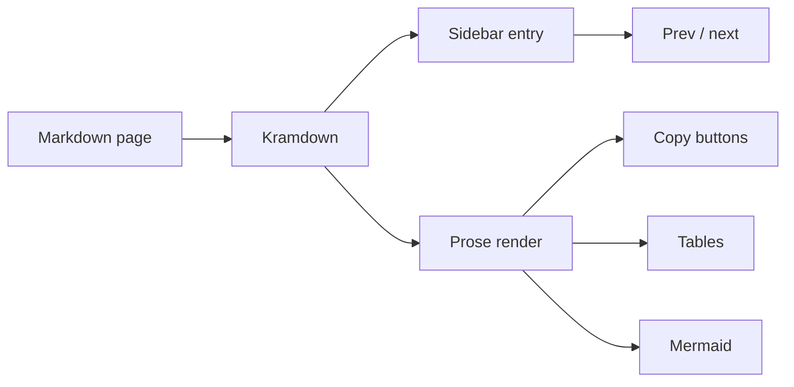

## Headings

The engine adds anchor links to headings on hover (try it), and the heading
above this text uses an id from its title. Sub-headings nest in order:

### Third level heading

#### Fourth level heading

## Text

This is a paragraph with **bold**, *italic*, ***both***, ~~strikethrough~~,
and `inline code` that wraps long identifiers like
`REALLY_LONG_FUNCTION_NAME_that_should_never_overflow_the_line` when
needed. Links look like [this one](https://example.com), with a subtle
underline that brightens on hover. Pressing <kbd>Ctrl</kbd> + <kbd>K</kbd>
does nothing here, but the keys render nicely.

## Lists

- unordered item one
- unordered item two
  - nested item
  - another nested item
- unordered item three

1. ordered item one
2. ordered item two
3. ordered item three

Task lists use checkboxes:

- [x] write the docs
- [x] render them with Stygian
- [ ] ship it

## Quotes

> A plain blockquote. It keeps the reading rhythm without shouting.

And callouts, via a kramdown attribute list on the blockquote:

> **Note:** this is a callout. Write the note text inside the quote and add
> `{: .callout }` on the next line.
{: .callout }

> **Warning:** callouts inherit the theme surface and glow color, so they
> stay legible in both light and dark mode.
{: .callout }

## Code

Inline code uses the mono stack with a bordered chip. Fenced blocks get a
copy button (hover the block) and a terminal-style surface:

```bash
gem build stygian.gemspec
jekyll build --baseurl /stygian
python3 -m http.server 4000 --directory _site
```

```yaml
collections:
  docs:
    output: true
    permalink: /:collection/:path/
defaults:
  - scope:
      path: ""
      type: docs
    values:
      layout: docs
```

```js
document.querySelectorAll('.sty-prose table').forEach((table) => {
  const wrap = document.createElement('div');
  wrap.className = 'table-scroll';
  table.parentNode.insertBefore(wrap, table);
  wrap.appendChild(table);
});
```

```diff
- remote_theme: just-the-docs/just-the-docs
+ remote_theme: ksauraj/stygian
```

## Tables

Plain markdown tables render on a bordered surface. Narrow screens scroll
the table horizontally instead of breaking the layout:

| Resource | Namespace | Replicas | Image | Status | Notes |
| --- | --- | ---: | --- | --- | --- |
| api-server | production | 3 | registry.example.com/api-server:v2.4.1 | Running | rolling update done |
| scheduler | production | 1 | registry.example.com/scheduler:v2.4.1 | Running | leader elected |
| worker-pool | production | 12 | registry.example.com/worker:v1.9.0 | Running | autoscaling active |
| canary | staging | 2 | registry.example.com/api-server:v2.5.0-rc1 | Running | 10% traffic |
| legacy-api | legacy | 4 | registry.example.com/legacy:v0.8.2 | Degraded | deprecation planned |

Code inside table cells stays on one line: `kubectl get pods -o wide`.

## Diagrams

Mermaid fences load the library lazily and render on demand. The theme
keeps a dark graph in dark mode and a neutral one in light mode:



## Horizontal rule

---

## Footnotes

Kramdown footnotes render at the bottom of the page[^1].

[^1]: This is a footnote. Reference it from anywhere with `[^1]`.
